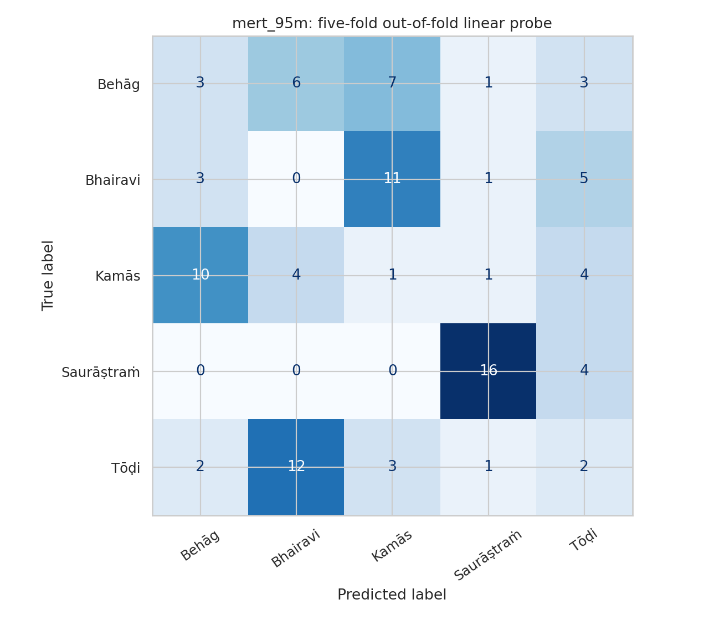
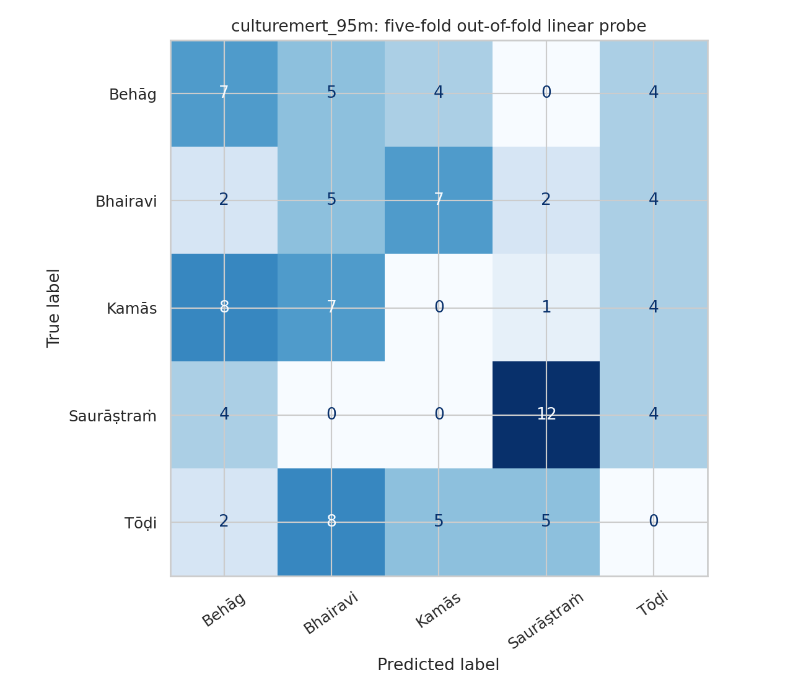
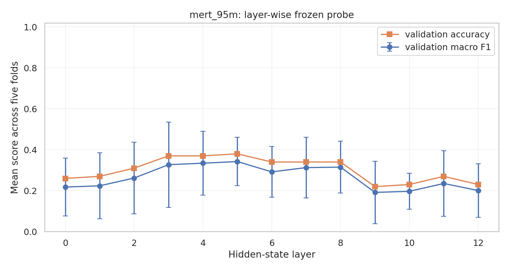
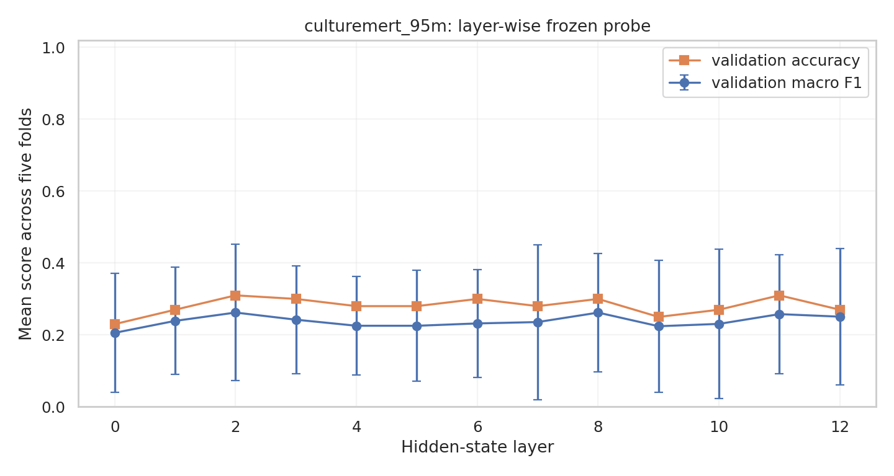

# Five-Fold Results

## Setup

I used five Carnatic ragas:

- Kamās
- Saurāṣtraṁ
- Tōḍi
- Behāg
- Bhairavi

Each raga had five original recordings. Every fold used three recordings for
training, one for validation and one for testing. After five folds, all 25
recordings had been used as unseen test data once.

There were 100 clips in total: four 30-second clips from each recording.

## Scores

| Model | Classifier | Clip accuracy | Clip top-3 | Track accuracy | Track top-3 |
|---|---|---:|---:|---:|---:|
| MERT | Linear | 22% | 77% | 24% | 72% |
| CultureMERT | Linear | 24% | 65% | 20% | 64% |
| MERT | Neural head | 19% | 68% | 16% | 68% |
| CultureMERT | Neural head | 19% | 70% | 24% | 72% |

Since there are five classes, random top-1 accuracy is 20% and random top-3
accuracy is 60%.

## What I Learned

The models did not malfunction. They produced different predictions, the layer
and hyperparameter sweeps ran, and some ragas were recognized better than
others. For example, MERT recognized many Saurāṣtraṁ clips correctly.

However, the overall top-1 scores stayed close to random guessing. I cannot
claim that CultureMERT is better than MERT from this experiment.

The external neural classifier also did not give a reliable improvement. Its
average training accuracy was much higher than validation accuracy:

- MERT neural head: 83.3% training vs 48% validation
- CultureMERT neural head: 80.3% training vs 34% validation

This is a sign of overfitting. The main reason is probably the small number of
independent recordings, not an error in the foundation models.

## Conclusion

On this small five-raga subset, frozen MERT and CultureMERT embeddings were not
enough for reliable classification of unseen recordings. CultureMERT did not
show a clear advantage.

The next useful experiment is to increase the number of original recordings.
After that, partial fine-tuning of the last few transformer layers can be
compared against this frozen baseline.

## Plots

### Linear classifiers

### Layer comparison

